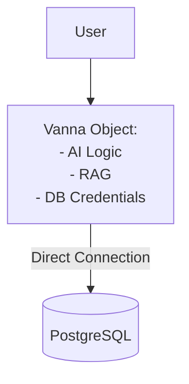
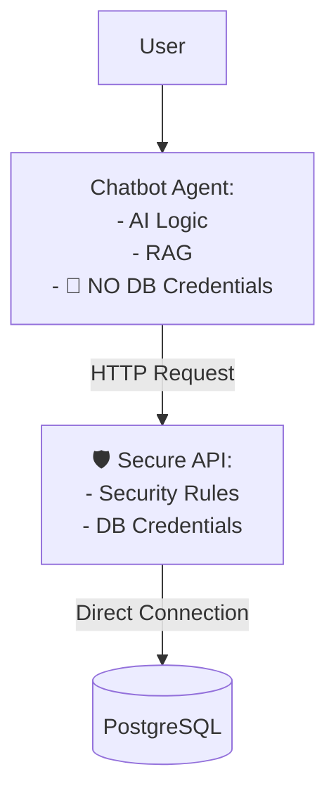

# Secure by Design: The Air-Gapped Architecture

## The Core Principle: Zero Trust

The entire security model of this project is built on a single, critical principle: **the AI agent never has direct access to the database.**

This "air gap" between the reasoning engine (the AI) and the execution engine (the database) is the foundation of the system's security.

---

## Visualization: The Two-Building Analogy

Imagine the system as two physically separate, secure facilities:

### 🏙️ Building A: The Chatbot Zone (Public)

This is where the LangGraph agent lives. It's brilliant at understanding language and talking to users. However, for maximum security, **it is not given the keys to the sensitive data.**

### 🏦 Building B: The Data Vault (Private)

This is where the PostgreSQL database resides. It's a high-security vault. Only processes with the highest level of trust are allowed inside.

---

## Architectural Comparison: Why We Deliberately Don't Use VannaBase `connect_to_postgres()`

This gets to the core of why our architecture is so robust. We have consciously rejected the simple, monolithic model in favor of a more secure, decoupled microservice pattern.

### Vanna's Default (Monolithic) Model:

- **Pros**: Simple, fast to set up.
- **Cons**: Tightly coupled, credentials are in the AI zone, single point of failure.

### Our Secure (Microservice) Model:

- **Pros**: Highly secure (air-gapped), decoupled, auditable, scalable.
- **Cons**: More components to manage (which we've already done).